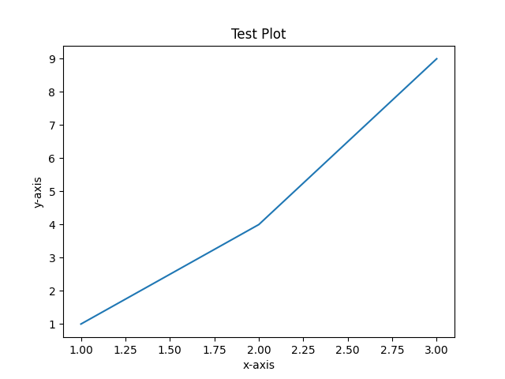

# About the author


# Quantum Approximate Optimization Algorithm (QAOA) - Max-Cut Problem

## Introduction
The Quantum Approximate Optimization Algorithm (QAOA) is a quantum algorithm designed to solve combinatorial optimization problems. One of the classic problems in this domain is the **Max-Cut Problem**.

## Problem Description
The Max-Cut Problem involves partitioning the vertices of a graph into two disjoint subsets such that the number of edges between the subsets is maximized. This problem is NP-hard, making it challenging to solve for large graphs using classical algorithms.

## Techniques Used
In this implementation, we utilize:
- **Quantum Circuits**: We create a quantum circuit that represents the Max-Cut problem using Qiskit.
- **QAOA**: The algorithm applies a series of quantum gates to prepare a superposition of states that encode potential solutions to the Max-Cut problem.
- **Measurement**: Finally, we measure the qubits to obtain the solution.

## How to Run the Code
1. Ensure you have Qiskit installed in your Python environment.
2. Run the `qaoa.py` script to execute the quantum circuit and visualize the results.
3. Analyze the output histogram to understand the distribution of the solutions.

## Significance of the Plot
The plot generated by the algorithm illustrates the distribution of measurement outcomes from the quantum circuit. Each bar represents the frequency of a particular state, providing insights into the potential solutions to the Max-Cut problem. A higher frequency indicates a more favorable partitioning of the graph's vertices.

## Advantage of QAOA Over Classical Methods
The Quantum Approximate Optimization Algorithm (QAOA) can outperform classical algorithms in solving combinatorial optimization problems like Max-Cut by exploring multiple solutions simultaneously. This parallelism allows QAOA to potentially find better solutions in fewer iterations compared to classical methods, which typically evaluate one solution at a time.

## Source of the Advantage
The advantage of QAOA stems from the principles of quantum mechanics, particularly superposition and entanglement. These principles enable quantum computers to represent and process a vast number of possibilities simultaneously, providing a computational edge in solving complex optimization problems.

## Advantage of QAOA Over Classical Methods
The Quantum Approximate Optimization Algorithm (QAOA) can outperform classical algorithms in solving combinatorial optimization problems like Max-Cut by exploring multiple solutions simultaneously. This parallelism allows QAOA to potentially find better solutions in fewer iterations compared to classical methods, which typically evaluate one solution at a time.

## Source of the Advantage
The advantage of QAOA stems from the principles of quantum mechanics, particularly superposition and entanglement. These principles enable quantum computers to represent and process a vast number of possibilities simultaneously, providing a computational edge in solving complex optimization problems.


## Results



### Explanation
The plot above illustrates the distribution of measurement outcomes from the quantum circuit used in the QAOA implementation for the Max-Cut problem. Each bar in the histogram represents the frequency of a particular state, indicating how often each potential solution was measured during the execution of the algorithm.

### Significance
The significance of this plot lies in its ability to provide insights into the effectiveness of the QAOA algorithm. A higher frequency for a particular state suggests that the corresponding partitioning of the graph's vertices is more favorable, thus indicating a better solution to the Max-Cut problem.

### Interpretation
By analyzing the plot, researchers can ascertain which solutions are more likely to yield optimal results. This information can guide further experimentation and refinement of the algorithm, as well as provide a basis for comparison with classical methods in solving combinatorial optimization problems.

## Conclusion
This implementation serves as a basic introduction to using QAOA for solving the Max-Cut problem. Further optimizations and enhancements can be made to improve performance and accuracy.

## Citation
If you use this code or build upon it in your research or applications, please cite it as follows:

### BibTeX
```bibtex
@software{qaoa_maxcut_implementation,
    author = {Debasis},
    title = {QAOA Implementation for Max-Cut Problem},
    year = {2025},
    url = {https://github.com/debasis/QAOA},
    note = {Quantum Approximate Optimization Algorithm implementation for solving the Max-Cut problem}
}
```

### APA
```
Debasis. (2025). QAOA Implementation for Max-Cut Problem [Computer software].
```

### Plain Text
```
Debasis (2025). QAOA Implementation for Max-Cut Problem. 
Available at: https://github.com/debasis/QAOA
```

Please note that proper attribution helps maintain the academic integrity of the field and allows others to find and build upon this work. If you make significant modifications or improvements to this code, consider also citing the original work along with your contributions.
